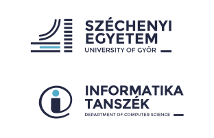

# Hasznos linkek

## Általános linkek

- Informatika Tanszék honlap: [it.sze.hu](https://it.sze.hu)
- Szelearning portál: [szelearning.sze.hu](https://szelearning.sze.hu/)

## Tantárgyakhoz tartozó linkek

- `GKxB_INTM021` - Programozás
- `GKxB_INTM049` - Web technológiák 
- `GKxB_INTM006` - Modern szoftverfejlesztési eszközök

## Tanszéki GitHub felhasználók

- :octocat: [wajzy](https://github.com/wajzy)
- :octocat: [csapoadam](https://github.com/csapoadam)
- :octocat: [hegyhati](https://github.com/hegyhati)
- :octocat: [hollosijanos](https://github.com/hollosijanos)
- :octocat: [horverno](https://github.com/horverno)
- :octocat: [kajdocsilaszlo](https://github.com/kajdocsilaszlo)
- :octocat: [oliverosz](https://github.com/oliverosz)
- :octocat: [zoleeeka](https://github.com/zoleeeka)

## Tanszékhez köthető GitHub felhasználók

- :octocat: [kyberszittya](https://github.com/kyberszittya)
- :octocat: [varjasin](https://github.com/varjasin)
- :octocat: [aronball](https://github.com/aronball)

## Releváns kutatási projektek

# Tanszéki logo

